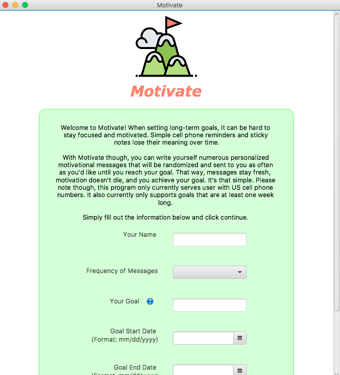
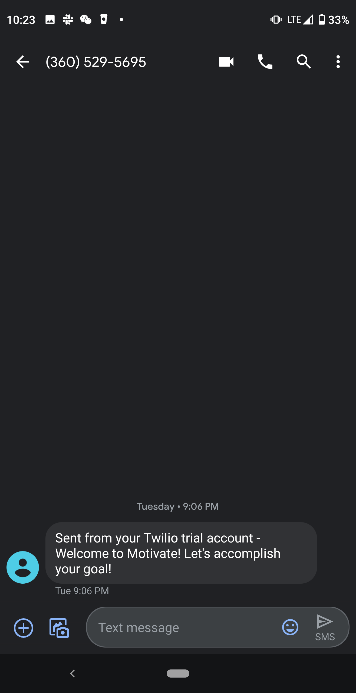

# MosaHackathonMotivateApp
The Motivate App 

# What is Motivate for?

  We often take on long term goals that require focus, discipline, and staying motivated for an extended period of time. These goals might be things like working out, earning a graduate degree, or eating healthy. The hardest part of accomplishing these goals is staying diligent and motivated until completion, often weeks or months down the line. 

  We can paste a motivational quote in our rooms or smartphone background to keep ourselves on track, but static reminders such as these often become boring to look at over time, and we forget what made that specific message so motivational to us in the first place. This experience in our own lives led us to design an app that keeps the inspiration customized and fresh, keeping you motivated until you accomplish your long term goal. 

# What it does

  Here enters the Motivate App. It makes the process of achieving our goals be more fun and less draining, through sending you customized and fresh motivation messages throughout the period you wish to accomplish your long term goals. You simply enters your goal, the start and end dates of the goal, the frequency at which you'd like to receive motivational messages, your phone number, and some motivational messages you would want to send to your future self. When you’re done, hit submit. 

  You’ll then get a welcome message from the app, and then your motivational messages will come at random times during the day at a frequency you desire (eg. twice a day, once a day, every other day, and once a week). 

  For example, if your goal is to get fit over the next two months, you would set the start and end date of your goal, and then craft a set of messages for yourself that you know will motivate you to stay on track. These might be things like a message about how you want to be in good enough shape to run that 10k in two months with your friends, or maybe a link to an inspirational video or song that gets you fired up and ambitious. Then, just wait and you’ll start to get these random bursts of inspiration as you work to meet your goal, keeping you focused on the journey to success.

# How to launch the app
1. Pull this repository from Github, open an Eclipse workspace, and import as a Java project. 
2. Click on the black arrow next to the green "Run" button 
3. Click Run Configurations
4. Under "Main" tab, make sure the Main Class is runner.MotivationRunner
5. Go to the “Arguments” tab and ensure that the “Use the -XstartOnFirstThread argument when launching with SWT” checkbox is NOT checked.
6. Click the green "Run" button again, and wait for the window shown below to appear, and follow the instructions on the page.  

7. On your phone, you should receive a welcome text like so, after all steps are complete. Make sure to leave the program open on the computer during the entire duration of your goal to continue receiving messages.

 

# Required Software and Versions

  To run this program, you will need to install JavaFX 11, Java 13, a Java IDE of your choice (most recent version of Eclipse recommended), and Twilio. JavaFX 11 and Twilio will be two sets of files you can download off the internet. The files for Twilio have been provided for you in the repository. Once you have those installed, simply follow the below instructions to add the libraries to your project:

1. Open the project in Eclipse.
2. Right click the project and select “Build Path” and then “Add Libraries...”
3. When the popup window opens, select “User Library” and click “Next”
4. On the next popup window, click “User Libraries”
5. On the next popup, click “New…” and give your new library a name
6. Then, select the new library and on the right-hand side click “Add external JAR files” and navigate to the files for either JavaFX or Twilio.
7. Select all the files that you can from that folder.
8. Then click “Apply and Close” and you should see the “Add Library” popup again with your new library selected. Click “Finish”.

Once both libraries have been imported, you can go ahead and run the “MotivationRunner.java” file. Note: if the app is not running, check the run configurations on each file in the program to make sure that the “Use the -XstartOnFirstThread…” checkbox is NOT checked. Sometimes this can be an issue in JavaFX.

# Future thoughts
We are working to incorporate other media besides text into our messages, such as GIFs, pictures, videos, and voice memos. We'd love to have it hosted on the web and make it available for anyone to use. 
